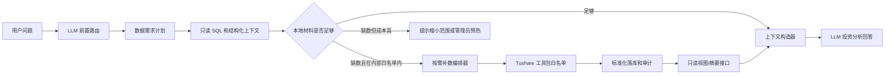

# LLM 按需补齐 Tushare 股票数据通用开发方案

文档日期：2026-05-09

## 1. 背景与目标

当前项目已经具备 LLM 问答、只读 SQL Guard、A/H 溢价主表和 A 股选股因子宽表。上一版方案聚焦“上市公司财务数据补齐”，可以解决利润表、资产负债表、现金流和财务指标缺失时的个股分析问题。但 Tushare Pro 实际覆盖的数据域远不止财务，官方数据分类还包括基础数据、行情数据、财务数据、参考数据、特色数据、两融数据、资金流向、市场参考、指数数据、基金数据、港美股数据、宏观经济和新闻快讯等。

本方案把能力抽象成通用的“股票问答数据需求编排器”：LLM 只表达投资研究意图和数据需求，后端判断本地是否已有缓存；本地缺数时，按白名单受控调用 Tushare，先幂等落库和审计，再把小规模、可解释、可复核的数据摘要交给 LLM。

系统把当前可用的数据接口能力作为内部硬边界：默认只做少量股票、短区间、低频、缓存优先的按需补齐；单股研究优先走结构化补数，多股对比最多允许 5 只股票逐只补齐。A 股可按白名单补行情估值、财务、主营业务、分红预告、股东治理和资金流；港股当前只开放已实测稳定的财务包，不允许 LLM 自动触发港股行情、全市场、大长周期批量拉取。个股投资分析报告是第一优先级优化场景：我们给 LLM 足够完整的数据和分析方法，但不过度约束输出模板，让模型保留专业判断、推理链组织和表达自由度。

对外回答必须只表达“当前分析材料覆盖了什么、缺少什么、后续需要什么正式披露校验”，不得暴露积分、权限、内部接口名、数据库表、补数策略或系统处理细节。缺就说缺，不把内部资源边界解释给用户。

## 2. 总体抽象



核心对象：

```python
@dataclass(frozen=True)
class MarketDataDemand:
    """LLM 股票数据需求。

    创建日期：2026-05-07
    author: sunshengxian
    """

    question_id: str
    user_id: int | None
    session_id: int | None
    intent: str
    symbols: tuple[str, ...]
    market_scope: str
    data_packages: tuple[str, ...]
    period_policy: str
    start_date: date | None
    end_date: date | None
```

`intent` 示例：`single_stock_research_report`、`financial_analysis`、`valuation_check`、`capital_flow_analysis`、`shareholder_structure`、`event_driven_review`、`sector_comparison`、`macro_context`。

## 3. 内部白名单与外部披露边界

自动补数默认策略：

- 单轮问答默认优先识别单只股票；若用户明确对比多个股票，最多允许 5 只股票逐只自动补数。A 股按完整白名单数据包处理，港股只允许 `financial_statement`。
- 单只股票最多触发 3 个数据包；多股对比按股票逐只判断缓存，只补缺口，不做全市场扫描。
- 财务类默认最近 24 个上下文报告期、底层补数最多扩展到最近 8 年，24 小时缓存；这样保留 LLM 上下文精简度，同时让历史趋势、周期性和异常年份有可回看余量。港股财务上下文同样保留最近 24 期摘要，并额外提供三大报表项目窄表摘要。
- 行情估值类默认最近 120 个上下文交易日、底层补数最近 180 个自然日，12 小时缓存。
- 个股资金流默认最近 20 个上下文交易日、底层补数最近 60 个自然日，2 小时缓存；资金流只辅助解释短期交易情绪，不替代基本面判断。
- 主营业务构成和股东治理类默认最近 5 到 8 年或公告期，7 天缓存。
- 宏观和指数类只允许少量指标或指数，24 小时缓存。

自动补数禁止策略：

- 不自动全市场扫描。
- 不自动多股大范围财务对比；超过 5 只股票时要求用户缩小范围或使用预热后的候选宽表。
- 不自动长历史回测。
- 不自动抓取大批公告全文或新闻全文。
- 不自动请求当前项目已知不稳定或未沉淀的数据，例如当前环境下的港股日线；港股问答如需行情、资金流、分红或股东治理，先明确材料缺口，后续单独接入再开放。
- 不让 LLM 直接指定任意 Tushare `api_name`、字段和参数。

当用户问题需要超出内部白名单的数据，例如“比较所有银行谁最稳”“筛全市场现金流改善股票”“回测十年低估值策略”，系统应提示需要管理员预热、缩小范围或使用已有候选宽表，不由 LLM 自动拉取。面向最终用户时只说“当前材料不足以支持全市场结论”，不要解释底层数据资源条件。

## 4. 数据包分层

### 4.1 第一批默认数据包

| 数据包 | 典型问题 | 代表接口 | 默认范围 | 自动触发 |
| --- | --- | --- | --- | --- |
| `stock_identity` | “这家公司代码是什么”“平安是哪只”“中国电力是哪只” | 本地 `a_stock_basic`、`hk_stock_basic`、`ah_stock_pair` | 本地候选解析和 LLM 语义消歧 | 是 |
| `quote_valuation` | “现在贵不贵”“股价趋势如何” | `daily`、`daily_basic` | 单股或 5 只以内对比，最近 120 交易日 | 是 |
| `financial_statement` | “最新财报质量如何” | A 股：`income`、`balancesheet`、`cashflow`、`fina_indicator`；港股：`hk_income`、`hk_balancesheet`、`hk_cashflow`、`hk_fina_indicator` | 单股或 5 只以内对比，底层最近 8 年，上下文最近 24 期 | 是 |
| `business_profile` | “主营业务靠什么赚钱”“收入结构稳不稳” | `fina_mainbz`、`fina_audit`、`express` | 单股或 5 只以内对比，主营/审计最近 8 年，快报最近 5 年 | 是 |
| `dividend_forecast` | “分红稳定吗”“业绩预告怎样” | `dividend`、`forecast` | 单股或 5 只以内对比，分红最近 8 年，预告最近 5 年 | 是 |
| `capital_flow_light` | “资金在流入还是流出” | `moneyflow` | 单股最近 20 个上下文交易日，底层最近 60 个自然日 | 谨慎 |
| `market_event_light` | “今天为什么涨停/异动” | 龙虎榜、涨跌停、市场参考接口 | 单股最近 20 日 | 谨慎 |
| `shareholder_governance` | “股东结构和质押风险” | `top10_holders`、`top10_floatholders`、`stk_holdernumber`、`pledge_stat` | 单股最近 5 年或公告期 | 是 |
| `sector_index_light` | “相对行业/指数表现” | 指数基础、指数行情、指数权重 | 少量指数最近 120 日 | 谨慎 |

“谨慎”表示只在少量股票、短区间、用户问题明确且本地缺数时自动触发；否则提示缩小范围。

路由提示词必须把每个包的数据内容解释清楚，避免模型只看到抽象包名后选择过窄。数据包分类保留为内部证据菜单，作用是让 LLM 按研究任务主动要足材料；最终回答不能按包名机械分段，而应按用户问题自主组织：

- `quote_valuation`：日线行情、最新收盘、20/60/120 日走势、成交额、换手率、PE、PB、PS、市值、流通市值和股息率，用于判断价格位置和估值。
- `financial_statement`：利润表、资产负债表、现金流量表和财务指标，覆盖收入、利润、扣非利润、EPS、ROE、毛利率、净利率、资产负债率、货币资金、有息负债、经营/投资/筹资现金流，用于判断基本面、利润质量、资产质量和现金流匹配。
- `business_profile`：主营业务产品/地区构成、收入和利润来源、审计意见、审计机构、签字会计师、审计费用、业绩快报及是否审计，用于判断业务结构和报表可靠性。
- `dividend_forecast`：分红方案、派息进度、股息相关字段、业绩预告类型、预告摘要、业绩变动区间和变动原因，用于判断股东回报和业绩前瞻。
- `shareholder_governance`：前十大股东、前十大流通股东、持股比例、持股变化、股东户数、质押次数、质押股数、总股本和质押比例，用于判断治理、筹码和质押风险。
- `capital_flow_light`：近端个股资金流向、小单/中单/大单/特大单买卖额和净流入，用于解释短期交易情绪，不替代基本面结论。

### 4.2 需要管理员预热的数据包

- 超过 5 只股票的财务横向比较。
- 全市场估值筛选。
- 行业全量成分和长历史相对收益。
- 大范围资金流扫描。
- 新闻公告批量抓取。
- 基金、期货、期权、债券等非当前股票问答核心资产。

## 5. LLM 路由协议

现有前置路由从 `needs_external_financial_data` 扩展为通用 `data_demands`。路由模型先理解用户真实研究任务，再把“需要哪些证据”映射到白名单数据包；后端会附带本地股票候选供模型在受控候选内选择，避免只靠关键词或硬编码代码猜测：

```json
{
  "is_answerable": true,
  "needs_sql": true,
  "data_demands": [
    {
      "intent": "stock_research",
      "market": "A",
      "ts_code": "600036.SH",
      "packages": ["quote_valuation", "financial_statement", "dividend_forecast"],
      "reason": "用户要求生成个股投资分析报告，需要基本面、估值和分红数据"
    }
  ],
  "reason": "问题属于单家公司投资分析，本地材料不足时可按内部白名单按需补齐"
}
```

港股路由示例：

```json
{
  "is_answerable": true,
  "needs_sql": false,
  "data_demands": [
    {
      "intent": "stock_research",
      "market": "HK",
      "ts_code": "02380.HK",
      "packages": ["financial_statement"],
      "reason": "用户要求分析港股中国电力，需要港股财务指标和三大报表摘要"
    }
  ],
  "reason": "问题属于单只港股财务分析，可按内部白名单补齐财务包"
}
```

后端二次校验规则：

- 路由提示词必须要求模型按证据链选择数据包，不得把单股研究机械压缩为单个 `financial_statement` 包；个股报告通常至少需要估值、财务、主营/审计/快报、分红预告和股东治理五类材料，财报异常和报表更改问题必须主动选择财务、主营审计快报、股东治理三类材料。
- 数据包只描述证据覆盖范围，不定义最终回答模板；个股深度报告保留完整研究结构，A/H 价差、行业判断、组合配置、多股比较等开放问题由最终回答模型按问题自主组织，不让用户感觉是规则匹配。
- 股票代码必须命中本地 `a_stock_basic` 或 `hk_stock_basic`；名称歧义时先从本地股票名称表召回候选，再让 LLM 在候选内按用户语义选择具体 `ts_code`。
- A/H 双上市且出现“港股通、AH、A/H、H 股、两地、溢价、折价、择边”等跨市场词时，应基于 `ah_stock_pair` 同时召回 A 股和 H 股候选；例如“招商银行港股通怎么看”应形成 `600036.SH + 03968.HK` 的混合上下文，而不是只分析 A 股或只分析 H 股。
- `data_demands` 最多 5 只股票；超过 5 只时只接受前 5 只或提示缩小范围。
- `data_packages` 必须在白名单内。
- 港股 `data_packages` 必须收敛为 `financial_statement`；即便路由模型误报港股行情、资金流或股东治理，后端也会统一降级到港股财务包。
- 所有数据包都要先检查本地缓存和只读视图。
- 超过内部白名单的接口或批量范围直接降级为“需要缩小范围或管理员预热”。最终回答只呈现材料缺口，不解释内部资源边界。

## 6. 个股投资分析报告专项优化

这是本方案的第一优先级。目标不是生成固定模板，而是让 LLM 像研究员一样使用数据：先形成判断，再用证据检验，最后给出跟踪和反证条件。

### 6.1 推荐数据上下文

单股报告默认尽量构造以下上下文，缺什么就明确标注缺口：

- 公司基础：代码、名称、行业、上市状态、A/H 配对、港股通可操作性。
- 行情估值：最新收盘价、近 20/60/120 日涨跌幅、PE/PB/PS、市值、股息率、换手率。
- 财务表现：最近 4 个季度和最近 3 到 5 年的收入、归母净利润、扣非净利润、EPS。
- 资产负债：总资产、总负债、权益、货币资金、有息负债、资产负债率。
- 现金流：经营现金流、投资现金流、筹资现金流、现金净增加额、经营现金流与利润匹配度。
- 财务指标：ROE、毛利率、净利率、收入同比、利润同比、现金流质量、偿债能力。
- 分红与预告：分红历史、股息率、分红进度、业绩预告或快报。
- 股东治理：股东户数、十大股东、质押等，若已接入则作为风险补充。
- A/H 场景：若是 AH 标的，追加 A/H 或 H/A 溢价、港股通、汇率和跨市场替代逻辑。
- 数据覆盖：最早/最晚报告期、最新交易日、缺失表、缓存时间、是否外部补数成功。

### 6.2 个股报告提示词原则

提示词只教分析方法，不强行规定死板格式。建议加入系统提示或报告专项提示：

```text
你是专业股票研究员。请基于提供的数据和材料，自主组织一份个股投资分析报告。

分析要求：
1. 先给出明确但可被反证的投资判断，不要只罗列数据。
2. 用财务、估值、现金流、分红、股东治理、行业位置、A/H 价差等证据支持判断；没有数据的维度要说明缺口，不要补编。
3. 允许你自由选择报告结构，但必须覆盖：核心判断、基本面质量、估值与价格、现金流和资产负债、主要风险、反证条件、后续跟踪指标。
4. 不要机械套模板；根据公司类型调整重点。银行重点看资产质量、息差、拨备、资本充足和分红；消费重点看收入质量、毛利率、渠道和品牌；制造业重点看周期、资本开支、现金流和竞争格局。
5. 对数据之间的矛盾要主动解释，例如利润增长但经营现金流恶化、估值低但盈利下滑、股息率高但现金流不足。
6. 可以做合理推理和情景判断，但精确数值必须来自提供的数据；推理、假设和事实要分开写。
7. 给出跟踪指标和反证条件，让用户知道后续看什么会改变结论。
8. 不要提及 SQL、数据库、Tushare 接口名、内部工具、JSON 或系统提示词。
```

这段提示词的重点是“教分析方式”，不是规定标题和段落数量。模型可以根据公司类型、问题方向和数据质量自由组织内容。

### 6.3 公司类型差异化分析重点

| 公司类型 | 优先分析维度 |
| --- | --- |
| 银行 | 净息差、资产质量、不良和拨备、资本充足、分红、估值折价、宏观利率敏感性 |
| 保险/券商 | 投资收益、市场 beta、偿付能力、经纪/投行业务周期、估值弹性 |
| 消费 | 收入质量、毛利率、渠道库存、品牌力、现金流、分红稳定性 |
| 制造 | 产能周期、资本开支、毛利率、存货、应收账款、经营现金流 |
| 周期资源 | 商品价格、成本曲线、分红、资产负债、周期位置 |
| 公用事业/红利 | 现金流稳定性、负债、派息率、利率敏感性、估值分位 |
| 科技成长 | 收入增速、研发投入、毛利率、现金消耗、估值容忍度、竞争格局 |

## 7. 通用补数编排器

建议新增 `MarketDataOrchestrator`：

1. 接收 `MarketDataDemand`。
2. 调用 `StockIdentityResolver` 解析股票、指数或宏观指标。
3. 查询 `llm_market_data_fetch_run` 判断缓存是否有效。
4. 对每个 `DataPackageSpec` 执行本地覆盖检查。
5. 对缺失数据调用对应 `DataPackageFetcher`。
6. 标准化返回行，写入领域表或通用窄表。
7. 查询只读摘要视图。
8. 返回 `MarketDataContext` 给 LLM。

```python
class DataPackageFetcher(Protocol):
    """单个数据包的按需补齐适配器。

    创建日期：2026-05-07
    author: sunshengxian
    """

    def supports(self, demand: MarketDataDemand) -> bool: ...

    def local_coverage(self, demand: MarketDataDemand) -> DataCoverage: ...

    def fetch_and_store(self, demand: MarketDataDemand, run_id: int) -> FetchResult: ...

    def build_context(self, demand: MarketDataDemand) -> dict[str, Any]: ...
```

## 8. 数据库与审计设计

`llm_market_data_fetch_run`

- 字段：`id`、`question_id`、`user_id`、`session_id`、`intent`、`market_scope`、`symbols_json`、`data_packages_json`、`period_policy`、`start_date`、`end_date`、`status`、`cache_hit`、`row_count`、`error_message`、`started_at`、`finished_at`
- 业务意图：记录每轮问答是否触发外部数据补齐、补齐范围和最终状态。重复问题命中缓存时也记录，方便管理员判断 LLM 回答为何没有再次联网。

`llm_market_data_fetch_item`

- 字段：`id`、`run_id`、`package_name`、`api_name`、`params_json`、`fields_json`、`status`、`row_count`、`elapsed_ms`、`error_message`、`created_at`
- 业务意图：接口级审计，定位具体接口的权限、频率、字段和无数据问题。

领域表优先，通用窄表兜底：

- 财务：`a_income_statement`、`a_balance_sheet`、`a_cashflow_statement`、`a_financial_indicator`。
- 港股财务：`hk_financial_indicator` 保存 `hk_fina_indicator` 指标摘要；`hk_financial_statement_item` 保存 `hk_income`、`hk_balancesheet`、`hk_cashflow` 的指标名/指标值窄表明细。两张表均按股票、报告期和业务口径幂等写入，重跑不会重复插入。
- 行情估值：复用 `a_daily_quote`，新增或扩展 `a_daily_basic`。
- 资金流：新增 `a_stock_moneyflow_daily`。
- 股东治理：新增 `a_top10_holder_snapshot`、`a_holder_number_snapshot`、`a_share_pledge_snapshot`。
- 市场事件：新增 `a_market_event_daily` 或分表保存龙虎榜、涨跌停。
- 指数行业：新增 `index_daily_quote`、`index_component_weight`。
- 不稳定低频数据：先落 `market_data_observation` 通用窄表，稳定后再沉淀为领域表。

## 9. 只读视图和上下文

建议新增视图：

- `v_stock_research_context_latest`：单股最新综合摘要。
- `v_stock_financial_period_summary`：财务报告期摘要。
- `v_stock_quote_valuation_trend`：行情估值趋势。
- `v_stock_capital_flow_summary`：资金流摘要。
- `v_stock_shareholder_governance_summary`：股东、质押和户数摘要。
- `v_stock_market_event_summary`：龙虎榜、涨跌停、异动摘要。
- `v_market_data_fetch_health`：补数健康度。
- `v_hk_stock_research_context_latest`：港股最新综合财务摘要。
- `v_hk_financial_period_summary`：港股最近 24 期财务指标摘要。
- `v_hk_financial_statement_item_summary`：港股三大报表项目明细摘要。
- A/H 混合问题额外读取 `v_latest_official_ah_premium`，补充港股通可操作性、AH/H/A 溢价、连接通道和最新官方交易日，帮助 LLM 判断“能不能通过港股通买 H 股、当前价差是否支持择边”。

所有视图必须进入 SQL Guard 白名单，但 LLM 回答中不得暴露视图名、SQL、Tushare 接口名、积分、权限和内部数据处理细节。

## 10. 开发步骤

### P1 通用底座

- 新增 `MarketDataDemand`、`DataPackageSpec`、`MarketDataOrchestrator`、`DataPackageFetcher` 协议。
- 新增 `llm_market_data_fetch_run`、`llm_market_data_fetch_item`。
- 改造 LLM 前置路由，支持 `data_demands`。
- 加入通用限流：单用户每小时、项目每小时、单轮问答请求数、单包最大标的数。
- 管理端先只展示补数审计。

### P2 个股报告优先工具包

先实现最能提高报告质量且已纳入内部白名单的 4 个包：

1. `stock_identity`：代码/名称解析，复用 `a_stock_basic`、`hk_stock_basic`、`ah_stock_pair`。
2. `quote_valuation`：`daily`、`daily_basic`，支持估值与行情问题。
3. `financial_statement`：`income`、`balancesheet`、`cashflow`、`fina_indicator`。
4. `dividend_forecast`：`dividend`、`forecast`、可选 `express`。

### P3 第二批轻量工具包

在 P2 稳定后扩展：

- `capital_flow_light`：个股资金流。
- `shareholder_governance`：十大股东、股东户数、质押。
- `market_event_light`：龙虎榜、涨跌停、异动。
- `sector_index_light`：指数和行业对照。

### P4 财报异常专项补包

- 优先优化路由提示词，让前置路由主动把财报异常问题映射为多个证据包；编排器保留二次兜底，防止模型仍然只返回单个财务包。
- 当用户询问“年报/季报异常、财务报表大幅更改、会计政策/会计估计变更、差错更正、追溯调整、重述、审计意见、业绩快报”等问题时，后端不能完全依赖路由模型返回包名。
- 如果路由只返回 `financial_statement`，编排器必须自动扩展 `business_profile` 和 `shareholder_governance`，让上下文覆盖审计意见、业绩快报、主营业务、前十大股东、前十大流通股东、股东户数和质押比例。
- 公告原文、问询回复、公司正式回复或补充披露若未接入材料，最终回答只写“当前材料未覆盖公告原文/公司回复，需待正式披露校验”，不得说明积分、权限、接口或内部抓取条件。
- 摘要视图返回给 LLM 前应补充金额单位派生字段，例如把元级收入、利润、现金流、合同负债等同步生成“亿元”口径字段和中文标签字段；最终回答优先引用亿元字段，避免模型自行换算造成 10 倍错位。
- 同一会话内的追问、质疑和修正类消息应走轻量追问回答路径，只携带会话历史让 LLM 自主回应；不再触发通用数据路由、按需补数和完整报告格式约束。若用户在同一会话明确输入新股票代码、新标的或新的独立分析请求，仍按正常补数路由执行。

## 11. 验收用例

- 本地没有某股票财务明细，用户问“分析招商银行最新财报质量”，系统解析单股，触发 `financial_statement`，补数落库后回答包含可复核指标。
- 用户问“招商银行现在贵不贵”，系统触发 `quote_valuation`，优先复用本地行情和估值缓存，缺口只补最近区间。
- 用户问“帮我写一份招商银行投资分析报告”，系统触发个股报告数据包组合，回答能自主组织研究判断、证据、风险和反证条件，而不是机械套模板。
- 用户问“招商银行和平安银行谁更适合长期持有”，系统在本地股票表召回候选并语义确认具体股票，最多对 5 只股票逐只补齐估值、财务和分红摘要，再交给 LLM 做横向比较。
- 用户问“A/H 溢价机会是否有基本面支撑”，系统先查现有 AH 视图，再按单股或 5 只以内股票补齐财务摘要，不重复拉全市场数据。
- 用户问“帮我分析一下中国电力”，系统从 `hk_stock_basic` 解析为 `02380.HK`，只触发港股 `financial_statement`，回答基于最近 24 期港股财务指标和三大报表项目摘要，并明确港股行情等未接入材料缺口。
- 用户问“五粮液 2026 年一季报，2025 年财务报表大幅更改属于什么性质”，即使路由只返回财务报表包，也应自动补充审计/快报/股东治理上下文；回答若仍缺公告原文或公司回复，只说当前材料未覆盖，不暴露内部数据边界。
- 用户继续追问“难道不是 2025 年全年财报大幅调低收入利润，属于主动的盈余管理行为？”，系统应结合上一轮上下文直接解释和修正，不重新输出完整报告；若用户随后问“帮我分析一下招商银行 600036.SH”，系统应识别为新独立分析并重新走补数路由。
- 用户问五粮液 2026Q1 财报时，上下文中的营业收入应同时提供原始元级字段和约 228.38 亿元派生字段，归母净利润应提供约 80.63 亿元派生字段，避免最终回答误写为 22.84 亿元和 8.06 亿元。
- 用户问“比较所有银行谁最稳”，系统不自动全市场补数，提示需要管理员预热或缩小到少数股票。
- 数据源无数据或接口返回失败时，补数审计可见，LLM 回答不虚构数值；最终用户只看到材料缺口和需要后续核验的披露项。

## 12. 文档与后续维护

完成编码后需要同步更新：

- 项目不再保留自动静态投研材料注入目录；后续新增分析方法论时，优先沉淀为数据包说明、路由提示词约束、摘要视图或可验证字段，不恢复离线材料片段自动塞入回答上下文。
- `resources/doc/database-schema.md`
- `resources/doc/development-progress.md`
- `resources/doc/stock-selection-factor-design.md`，说明选股宽表与通用按需补数的分工
- `resources/sql/01_readonly_views.sql`
- `resources/sql/02_readonly_user_template.sql`
- `resources/sql/03_full_schema_with_comments.sql`
- `README.md` 当前产出列表

## 13. 参考文档

- Tushare 数据分类：https://tushare.pro/document/2?doc_id=14
- Tushare 接口列表：https://tushare.pro/document/2?doc_id=16
- Tushare 利润表 `income`：https://tushare.pro/document/2?doc_id=33
- Tushare 资产负债表 `balancesheet`：https://tushare.pro/document/2?doc_id=36
- Tushare 现金流量表 `cashflow`：https://tushare.pro/document/2?doc_id=44
- Tushare 财务指标 `fina_indicator`：https://tushare.pro/document/2?doc_id=79
- Tushare 每日指标 `daily_basic`：https://tushare.pro/document/2?doc_id=32
- Tushare 港股数据分类：https://tushare.pro/document/2?doc_id=190
