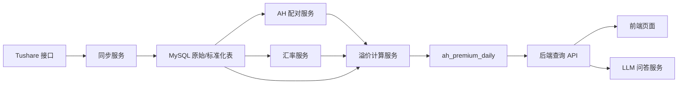

# 港股通 A/H 溢价数据助手一阶段详细开发方案

文档日期：2026-05-04

## 1. 背景与目标

一阶段建设一个本地运行的数据分析应用：

- 从 Tushare 按需拉取 A 股基础信息、A 股日行情、沪深港通名单、港股基础信息、港股行情、港股交易日历、外汇行情等数据。
- 将数据持久化到新的本地 MySQL 数据库 `stock_ah_ai`。
- 计算港股通范围内的 A/H 比价和 A/H 溢价率，形成可查询的结果表。
- 提供简单精美的 Web 页面，支持数据同步、榜单查看、趋势查看和同步状态观察。
- 支持通过 LLM API 对本地数据进行安全问答，例如“最近一个交易日溢价最高的前 10 只是什么”“某股票过去 30 个交易日溢价趋势如何”。

本阶段已进入代码开发。按用户要求，当前先完成大部分代码，不执行依赖高权限 Tushare Token、LLM Key 或本地 MySQL 的功能测试。

## 2. 技术选型

### 2.0 项目落位

本项目是同时包含前端和后端的混合 coding 项目，项目根目录为：

```text
/Users/salty/codeProject/ai/coding/stock-ah-premium-ai
```

正式开发时在该项目根下组织代码与文档：

- `backend/`：FastAPI 后端服务。
- `frontend/`：React 前端应用。
- `resources/doc/`：正式设计文档、审计报告、方案文档。
- `resources/sql/`：数据库初始化、迁移补充和只读视图脚本。

### 2.1 后端

- 语言与框架：Python 3.11+、FastAPI。
- 数据访问：SQLAlchemy 2.x、Alembic、PyMySQL。
- 数据处理：pandas、pydantic v2、python-dateutil。
- Tushare 接入：优先使用 Tushare Python SDK；保留 HTTP POST 适配器，便于统一重试、限流和错误处理。
- 后台任务：一阶段使用 APScheduler + 后端进程内任务；若后续任务量变大，再引入 Redis/RQ 或 Celery。
- 测试：pytest、respx 或 responses、freezegun。

选择理由：Tushare Python SDK 与 pandas 配合最直接；FastAPI 易于提供前端和 LLM 问答所需的 JSON API；APScheduler 足够覆盖本地单机定时同步，避免一阶段引入过多基础设施。

### 2.2 前端

- 框架：React 18 + Vite + TypeScript。
- UI：Ant Design 5。
- 图表：Apache ECharts。
- 数据请求：TanStack Query。
- 状态：优先使用组件状态和 Query 缓存，必要时再引入 Zustand。

页面风格应偏金融工具型：信息密度适中、指标清晰、表格可筛选排序、图表干净，不做营销式首页。

### 2.3 数据库

- 数据库：本地 MySQL 5.7。
- 新库名：`stock_ah_ai`。
- 字符集：`utf8mb4`。
- 排序规则：`utf8mb4_unicode_ci`。
- 本机连接信息：开发时按需参考 `/Users/salty/codeProject/ai/doc/mysqluse.md`，不得把密码写入代码库。

建议环境变量：

```bash
STOCK_AH_DB_URL=mysql+pymysql://<user>:<password>@127.0.0.1:3306/stock_ah_ai?charset=utf8mb4
TUSHARE_TOKEN=<local-only>
LLM_BASE_URL=<openai-compatible-base-url>
LLM_API_KEY=<local-only>
LLM_MODEL=<model-name>
```

## 3. Tushare 接口范围

已核对 Tushare 官方文档，接口列表和一阶段拟用接口如下：

| 数据域 | Tushare 接口 | 用途 | 一阶段策略 |
| --- | --- | --- | --- |
| A 股基础 | `stock_basic` | 股票代码、名称、行业、上市状态、沪深港通标识等 | 全量同步，定期刷新 |
| A 股日行情 | `daily` | A 股未复权日线收盘价和涨跌幅 | 按交易日或股票区间增量同步 |
| A 股交易日历 | `trade_cal` | 判断 A 股交易日、前一交易日 | 年度或区间同步 |
| 沪深港通股票列表 | `stock_hsgt` | 获取沪股通、深股通、港股通名单 | 重点同步 `SH_HK`、`SZ_HK` 两类港股通 |
| 港股基础 | `hk_basic` | 港股代码、名称、货币等 | 全量同步，定期刷新 |
| 港股日行情 | `hk_daily` | 港股日线收盘价和涨跌幅 | 按交易日或股票区间增量同步 |
| 港股交易日历 | `hk_tradecal` | 判断港股交易日 | 年度或区间同步 |
| 外汇基础 | `fx_obasic` | 查询 FXCM 支持的外汇代码 | 初始化或排查时使用 |
| 外汇日线 | `fx_daily` | 获取汇率日线 | 优先寻找 HKD/CNY；不可用时用 USD/CNH 与 USD/HKD 交叉计算 |
| AH 股比价 | `stk_ah_comparison` | 官方 AH 映射和官方比价结果 | 用于建立 AH 配对、校验自算结果；不作为唯一计算来源 |

Tushare 文档约束需要纳入任务调度：A 股日行情通常在交易日 15:00-16:00 入库，港股日行情约 18:00 更新，沪深港通名单早间更新，官方 AH 比价数据盘后更新。实际任务时间建议预留缓冲，避免拉到半截数据。

## 4. 核心业务定义

### 4.1 港股通范围

港股通标的取 `stock_hsgt` 中：

- `SH_HK`：港股通，沪市通道。
- `SZ_HK`：港股通，深市通道。

同一港股可能同时属于沪市和深市港股通，结果表中保留 `connect_channels`，例如 `SH_HK,SZ_HK`。

### 4.2 AH 配对来源

一阶段不建议用股票名称模糊匹配生成 AH 关系，风险太高。推荐策略：

1. 首选从 `stk_ah_comparison` 获取 `hk_code` 与 `ts_code`，落入 `ah_stock_pair`，作为官方配对来源。
2. 若 Tushare 权限不足或历史区间不足，支持人工 CSV 导入配对，记录 `source=MANUAL`。
3. 计算时只处理 `ah_stock_pair` 中存在配对、且港股代码在当日港股通名单内的记录。

### 4.3 汇率策略

目标汇率是 HKD -> CNY/CNH，记为 `hkd_cny`。

优先级：

1. 若 `fx_daily` 可直接提供 HKD/CNY 或 HKD/CNH 货币对，则使用直接报价。
2. 否则使用交叉汇率：`hkd_cny = usd_cnh / usd_hkd`。
3. 若 Tushare 外汇权限或覆盖不足，预留第二数据源适配器，例如公开央行/外汇接口或手工导入 CSV；结果表必须记录 `rate_source`。

汇率日期对齐：

- 默认使用与股票交易日同日的汇率。
- 若同日缺失，使用该日期前最近一个可用汇率，并在结果表记录 `rate_date` 与 `rate_fallback=true`。
- 若汇率仍缺失，结果标记为 `MISSING_RATE`，不生成溢价数值。

### 4.4 A/H 溢价公式

```text
h_close_cny = h_close_hkd * hkd_cny
ah_ratio = a_close_cny / h_close_cny
ah_premium_pct = (ah_ratio - 1) * 100
```

其中：

- `a_close_cny` 来源于 A 股 `daily.close`。
- `h_close_hkd` 来源于港股 `hk_daily.close`。
- `hkd_cny` 来源于汇率表。
- `ah_premium_pct > 0` 表示 A 股较 H 股溢价；小于 0 表示 A 股折价。

### 4.5 交易日对齐

一阶段采用“同自然日可计算”策略：

- A 股与港股同日均有收盘价时计算。
- 任一市场休市或停牌导致缺失时，结果记录 `MISSING_A_QUOTE` 或 `MISSING_H_QUOTE`。
- 不自动拿前一交易日价格补齐股票价格，避免混淆当日横截面对比。

## 5. 数据库设计

### 5.1 主要业务表

`a_stock_basic`

- 主键：`ts_code`
- 关键字段：`symbol`、`name`、`area`、`industry`、`market`、`exchange`、`curr_type`、`list_status`、`list_date`、`delist_date`、`is_hs`、`updated_at`

`hk_stock_basic`

- 主键：`ts_code`
- 关键字段：`name`、`fullname`、`market`、`list_status`、`list_date`、`delist_date`、`trade_unit`、`isin`、`curr_type`、`updated_at`

`a_trade_calendar`

- 唯一键：`exchange + cal_date`
- 关键字段：`is_open`、`pretrade_date`

`hk_trade_calendar`

- 主键：`cal_date`
- 关键字段：`is_open`、`pretrade_date`

`a_daily_quote`

- 唯一键：`ts_code + trade_date`
- 关键字段：`open`、`high`、`low`、`close`、`pre_close`、`change_amount`、`pct_chg`、`vol`、`amount`
- 索引：`trade_date`、`ts_code`

`hk_daily_quote`

- 唯一键：`ts_code + trade_date`
- 关键字段：`open`、`high`、`low`、`close`、`pre_close`、`change_amount`、`pct_chg`、`vol`、`amount`
- 索引：`trade_date`、`ts_code`

`hsgt_constituent`

- 唯一键：`trade_date + ts_code + type`
- 关键字段：`name`、`type_name`
- 说明：`type` 包含 `SH_HK`、`SZ_HK`、`HK_SH`、`HK_SZ`，一阶段重点筛选港股通两类。

`fx_rate_daily`

- 唯一键：`rate_pair + rate_date + source`
- 关键字段：`base_ccy`、`quote_ccy`、`mid_rate`、`bid_close`、`ask_close`、`source`、`raw_ts_code`
- 说明：`mid_rate` 可由买卖价中间价或交叉汇率计算。

`ah_stock_pair`

- 主键：自增 `id`
- 唯一键：`a_ts_code + hk_ts_code`
- 关键字段：`a_name`、`hk_name`、`source`、`effective_start_date`、`effective_end_date`、`is_active`

`ah_premium_daily`

- 唯一键：`trade_date + a_ts_code + hk_ts_code`
- 关键字段：`a_close_cny`、`h_close_hkd`、`hkd_cny`、`h_close_cny`、`ah_ratio`、`ah_premium_pct`、`is_hk_connect`、`connect_channels`、`rate_date`、`rate_source`、`rate_fallback`、`calc_status`
- 校验字段：`official_ah_ratio`、`official_ah_premium_pct`、`diff_from_official_pct`
- 索引：`trade_date + ah_premium_pct`、`hk_ts_code + trade_date`、`a_ts_code + trade_date`

### 5.2 任务与审计表

`sync_run`

- 字段：`id`、`dataset`、`params_json`、`status`、`started_at`、`finished_at`、`row_count`、`error_message`

`sync_checkpoint`

- 字段：`dataset`、`scope_key`、`last_success_date`、`last_run_id`、`updated_at`

`data_quality_issue`

- 字段：`id`、`issue_date`、`issue_type`、`severity`、`ref_key`、`message`、`resolved_at`

`llm_chat_session`

- 字段：`id`、`title`、`created_at`、`updated_at`

`llm_chat_message`

- 字段：`id`、`session_id`、`role`、`content`、`sql_text`、`result_preview_json`、`created_at`

### 5.3 MySQL 5.7 注意事项

- 不依赖 MySQL 8 的窗口函数、CTE 或 CHECK 约束。
- 金额、价格、汇率使用 `DECIMAL`，避免浮点误差。
- `params_json` 等低频字段可使用 MySQL 5.7 支持的 `JSON`；如迁移兼容性有问题，降级为 `LONGTEXT`。
- 批量 upsert 使用 `INSERT ... ON DUPLICATE KEY UPDATE`。

## 6. 后端模块设计

建议目录结构：

```text
stock-ah-premium-ai/
  backend/
    app/
      api/
        routes_sync.py
        routes_market.py
        routes_chat.py
        routes_settings.py
      core/
        config.py
        logging.py
        security.py
      db/
        base.py
        session.py
        models/
        migrations/
      services/
        tushare_client.py
        sync_service.py
        ah_pair_service.py
        premium_calc_service.py
        fx_rate_service.py
        llm_service.py
        sql_guard_service.py
      jobs/
        scheduler.py
        sync_jobs.py
      schemas/
    tests/
  frontend/
    src/
      api/
      components/
      pages/
      routes/
      styles/
  resources/
    doc/
    sql/
```

核心服务职责：

- `tushare_client`：统一封装 SDK/HTTP、重试、限流、字段选择、错误码处理。
- `sync_service`：根据数据集和时间范围执行同步，记录 `sync_run` 和 checkpoint。
- `ah_pair_service`：维护 AH 配对，支持官方接口导入和人工导入。
- `fx_rate_service`：维护直接汇率和交叉汇率，暴露按日期取 HKD/CNY 的方法。
- `premium_calc_service`：读取行情、配对、港股通名单和汇率，生成 `ah_premium_daily`。
- `llm_service`：封装 OpenAI-compatible Chat API，不把密钥暴露给前端。
- `sql_guard_service`：对 LLM 生成的 SQL 做只读、白名单、limit、超时校验。

## 7. API 设计

同步与任务：

- `GET /api/datasets`：返回支持同步的数据集、参数说明、最近同步状态。
- `POST /api/sync/runs`：创建同步任务。参数包含 `dataset`、`startDate`、`endDate`、`symbols`。
- `GET /api/sync/runs`：查看同步任务列表。
- `GET /api/sync/runs/{runId}`：查看任务详情和错误。

计算与行情：

- `POST /api/ah-premiums/calculate`：计算指定日期或日期区间的 AH 溢价。
- `GET /api/ah-premiums`：分页查询溢价结果，支持日期、代码、行业、通道、溢价区间筛选。
- `GET /api/ah-premiums/summary`：返回最新交易日概览、最高/最低溢价、缺失数据数量。
- `GET /api/ah-premiums/{aTsCode}/{hkTsCode}/trend`：返回指定 AH 配对的趋势。
- `POST /api/manual-import/ah-pairs`：当 Tushare AH 比价权限不足时，导入人工 AH 配对 JSON。
- `POST /api/manual-import/fx-rates`：当 Tushare 外汇权限不足时，导入人工汇率 JSON。
- `POST /api/manual-import/ah-pairs/csv`：导入人工 AH 配对 CSV。
- `POST /api/manual-import/fx-rates/csv`：导入人工汇率 CSV。

LLM 问答：

- `POST /api/chat/sessions`：创建会话。
- `POST /api/chat/sessions/{sessionId}/messages`：提交问题，返回回答、引用数据、可选 SQL。
- `GET /api/chat/sessions/{sessionId}`：查看历史消息。

## 8. LLM 问答安全方案

前端不直接调用 LLM；所有请求进入后端。

推荐流程：

1. 用户在页面输入问题，并可选择日期范围、股票、行业等上下文。
2. 后端把问题、可用数据表说明、字段说明、业务口径传给 LLM。
3. LLM 生成一个只读查询计划，必要时生成 SQL。
4. `sql_guard_service` 校验 SQL：
   - 只允许 `SELECT`。
   - 只允许访问白名单视图或表。
   - 禁止 `INSERT`、`UPDATE`、`DELETE`、`DROP`、`ALTER`、`CREATE`、多语句。
   - 自动加 `LIMIT`，设置查询超时。
5. 后端执行只读查询，拿到小结果集。
6. LLM 基于结果集生成中文回答，并附带数据口径说明。

建议为 LLM 问答创建只读数据库账号，仅授予查询视图权限。可优先开放视图：

- `v_latest_ah_premium`
- `v_ah_premium_trend`
- `v_sync_health`
- `v_data_quality_issues`

## 9. 前端页面设计

### 9.1 总览页

展示：

- 最新可用交易日。
- 已计算 AH 配对数量。
- 港股通标的覆盖数量。
- 溢价最高/最低 Top 10。
- 数据缺失和最近同步异常提示。

视觉：

- 顶部紧凑指标条。
- 中部左右布局：左侧榜单表格，右侧趋势/分布图。
- 配色使用白底、深色文字、绿色/红色涨跌提示和少量蓝色强调。

### 9.2 数据同步页

展示：

- 数据集选择：A 股基础、A 股日线、港股通名单、港股基础、港股日线、汇率、AH 配对。
- 日期范围、股票代码输入、立即同步按钮。
- 最近任务列表、状态、耗时、行数、错误详情。

### 9.3 AH 溢价页

展示：

- 日期选择器。
- 溢价榜单表格：A 股代码、H 股代码、名称、A 收盘、H 收盘、汇率、A/H 比价、溢价率、港股通通道。
- 筛选：溢价率区间、通道、股票名称/代码。
- 趋势抽屉或详情页：展示单个 AH 配对的历史溢价曲线。

### 9.4 智能问答页

展示：

- 聊天输入框。
- 数据范围控件。
- 回答中的关键数据表格和引用口径。
- 可折叠的 SQL/查询计划，默认收起。

页面示例问题：

- 最近一个交易日 A/H 溢价最高的 10 只港股通股票是什么？
- 中国平安近 60 个交易日 A/H 溢价率趋势如何？
- 哪些股票今天无法计算溢价，原因是什么？
- 最近一周港股通 AH 溢价均值变化最大的是哪些？

## 10. 数据同步与计算流程



推荐日常任务顺序：

1. 09:40 后同步港股通名单 `stock_hsgt`。
2. 16:15 后同步 A 股日行情 `daily`。
3. 18:30 后同步港股日行情 `hk_daily` 和汇率 `fx_daily`。
4. 18:45 后导入/校验 `stk_ah_comparison`。
5. 19:00 后计算当日 `ah_premium_daily`。

历史初始化任务顺序：

1. 创建数据库和表结构。
2. 同步 A 股、港股基础信息。
3. 同步 A 股、港股交易日历。
4. 同步 AH 配对。
5. 按日期循环同步港股通名单、A 股行情、港股行情、汇率。
6. 按日期批量计算 AH 溢价。

## 11. 一阶段开发计划

| 阶段 | 工作内容 | 交付物 | 验收标准 |
| --- | --- | --- | --- |
| P0 方案确认 | 确认目标、技术栈、数据口径、数据库名、目录结构 | 本文档 | 已完成 |
| P1 后端骨架与数据库 | 创建 FastAPI 项目、配置管理、Alembic、MySQL 连接、建表迁移 | 后端项目、迁移脚本 | 已编码，待真实 MySQL 验证 |
| P2 Tushare 同步 | 封装 Tushare 客户端，实现基础信息、行情、港股通、汇率同步 | 同步 API、同步任务、单元测试 | 已编码，待高权限 Token 验证 |
| P3 AH 配对与溢价计算 | 导入 AH 配对，计算港股通 A/H 溢价，落 `ah_premium_daily` | 计算服务、结果查询 API | 已编码，待真实数据验证 |
| P4 LLM 问答 | OpenAI-compatible 适配、只读 SQL Guard、问答 API | 聊天 API、提示词模板、只读查询视图 | 已编码，待 LLM Key 验证 |
| P5 前端页面 | 总览、同步、AH 溢价、智能问答页面 | React 前端 | 已编码，待前后端联调 |
| P6 联调与验收 | 端到端测试、异常处理、README、启动脚本 | 完整本地运行说明 | README 已更新；功能测试按用户要求暂不执行 |

建议排期：8-12 个工作日。

- 第 1-2 天：P1。
- 第 3-5 天：P2。
- 第 6-7 天：P3。
- 第 8-9 天：P4。
- 第 10-11 天：P5。
- 第 12 天：P6 和文档收尾。

## 12. 验收用例

数据入库：

- 创建新库 `stock_ah_ai`，运行迁移后存在全部业务表、任务表和必要索引。
- 同步某一交易日的 `daily`、`hk_daily`、`stock_hsgt`，重复执行不会产生重复数据。
- Tushare Token 缺失、权限不足、频率限制时，任务状态和错误信息可读。

溢价计算：

- 给定一组 A 股收盘价、H 股收盘价和 HKD/CNY 汇率，计算结果与公式一致。
- 当 H 股不在港股通名单内时，不进入港股通 AH 溢价结果。
- 当行情或汇率缺失时，结果状态明确，不产生误导性数值。
- 若有官方 `stk_ah_comparison` 结果，记录自算与官方差异。

前端：

- 总览页展示最新交易日、Top 榜单和同步健康状态。
- AH 溢价页能按日期、股票、溢价率筛选。
- 同步页能发起任务并看到任务状态。
- 智能问答页能返回中文解释和数据依据。

LLM 安全：

- 前端看不到 LLM API Key。
- LLM 生成写库 SQL 时被拦截。
- 查询默认有行数限制和超时。

## 13. 风险与应对

| 风险 | 影响 | 应对 |
| --- | --- | --- |
| Tushare 积分或权限不足 | 部分接口不可用 | 提前运行权限检查；支持 CSV 补录 AH 配对和汇率；错误在同步页可见 |
| 港股通名单和 AH 配对历史不足 | 历史计算覆盖不完整 | 记录数据覆盖起止日；结果页展示数据范围 |
| 汇率口径差异 | 自算溢价与官方值有差异 | 保存 `rate_source`、`rate_date`、官方比价字段，便于追踪 |
| A 股和港股休市不同步 | 部分日期无法计算 | 明确同日计算口径；缺失状态入库 |
| LLM 生成错误 SQL | 数据问答不可靠或有安全风险 | 白名单视图、SQL 解析、只读账号、limit、超时、答案附口径 |
| MySQL 5.7 能力限制 | 复杂分析 SQL 不便 | 预先建查询视图和聚合接口；避免依赖 MySQL 8 特性 |

## 14. 后续扩展

- 支持定时自动同步和失败重试告警。
- 支持行业、指数、财务指标维度的溢价解释。
- 支持导出 Excel/CSV。
- 支持更多 LLM 工具调用，例如自动生成筛选条件、图表解释。
- 支持 Docker 化或本地一键启动脚本。
- 支持权限和多用户收藏股票池。

## 15. 参考文档

- Tushare 调取 Pro 版数据：https://tushare.pro/document/1?doc_id=40
- Tushare 接口列表：https://tushare.pro/document/2
- 股票基础信息 `stock_basic`：https://tushare.pro/document/2?doc_id=25
- A 股日线 `daily`：https://tushare.pro/document/2?doc_id=27
- 沪深港通股票列表 `stock_hsgt`：https://tushare.pro/document/2?doc_id=398
- AH 股比价 `stk_ah_comparison`：https://tushare.pro/document/2?doc_id=399
- 港股基础 `hk_basic`：https://tushare.pro/document/2?doc_id=191
- 港股日线 `hk_daily`：https://tushare.pro/document/2?doc_id=192
- 港股交易日历 `hk_tradecal`：https://tushare.pro/document/2?doc_id=250
- 外汇基础 `fx_obasic`：https://tushare.pro/document/2?doc_id=178
- 外汇日线 `fx_daily`：https://tushare.pro/document/2?doc_id=179
